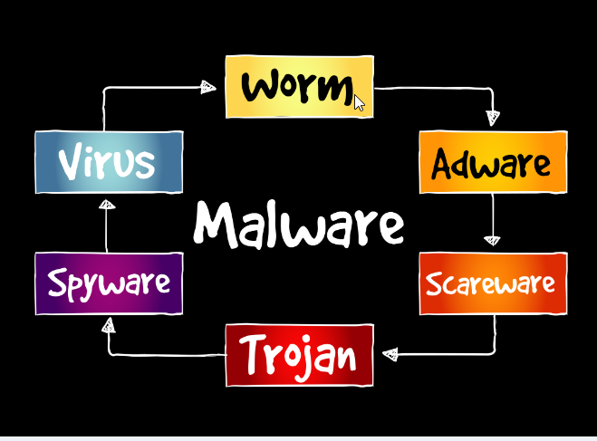

# Day 1: Introduction to Malware Analysis

**What is Malware**:

Malware, short for malicious software, is an executable file or binary that is designed to perform harmful actions on a computer system. Attackers use malware to achieve a variety of malicious objectives. These objectives can range from spying on a target, often through tools like remote access trojans (RATs) or keyloggers, to more destructive activities such as data exfiltration (stealing data) or data destruction.

Understanding malware is crucial for anyone entering the field of cybersecurity. As I delve deeper into these aspects, sharing these types of logs will help you take the first step in your cybersecurity career.

# Types of Malware:

Malware refers to any binary or executable that is malicious. However, malware is categorized into different types based on its functionality. Here are the various types of malware:

**Trojans**: 
A type of malware that disguises itself as a legitimate program, often used in social engineering attacks. Trojans can destroy or exfiltrate data and are also commonly used for spying.

**RATs (Remote Access Trojans)**: 
Malware that allows an attacker to access and execute commands on a compromised system remotely. RATs can have extended functionality through modules, such as keyloggers.

**Ransomware**: 
Malware that encrypts all files on a system, effectively holding the system and its data hostage until a ransom is paid.

**Droppers**: 
A type of malware designed to download or "drop" additional malicious software onto the infected system.

  

 
> Type of embeded malware.

# What Is Malware Analysis?

Malware analysis examines a malware sample or binary to extract as much information as possible. This analysis helps us understand the scope and functionality of the malware, how the system was infected, and how to defend against similar attacks in the future.

**Objectives of Malware Analysis**:

**Identify the Type of Malware and Its Functionality**:
Determine whether the malware is a keylogger, RAT, ransomware, or another type of malicious software.

**Understand the Infection Method**: 
Analyze how the system was compromised, whether through a targeted attack, phishing, or another vector.

**Analyze Communication Channels**: 
Determine how the malware communicates with the attacker.

**Extract Indicators of Compromise (IoCs)**: 
Identify useful indicators such as registry entries, keys, and filenames to create signatures for detecting future attacks.

# Types of Malware Analysis:

**Static Analysis**: 
This involves analyzing malware without executing it. The goal is to extract as much metadata as possible from the malware, such as strings, Portable Executable (PE) headers, and other structural details.

**Dynamic Analysis**: 
This involves executing the malware in a controlled environment to observe its functionality and behavior in real-time. The objective is to understand exactly what the malware does during execution, often using tools like debuggers to monitor its actions.

**Code Analysis**: 
This is the process of analyzing or reverse-engineering the malware's assembly code. Code analysis can be performed both statically (without running the code) and dynamically (by executing the code), allowing for a deep understanding of the malware's inner workings.

**Behavioral Analysis**: 
This involves monitoring the malware after execution to analyze its interactions with the system. This includes observing processes, registry entries, and network activity to determine how the malware operates and affects the system. 

# References: 

■ [How You Can Start Learning Malware Analysis | SANS Institute!](https://www.sans.org/blog/how-you-can-start-learning-malware-analysis/) 
■ [Practical Malware Analysis Essentials for Incident Responders](https://www.youtube.com/watch?v=20xYpxe8mBg&feature=emb_title)

